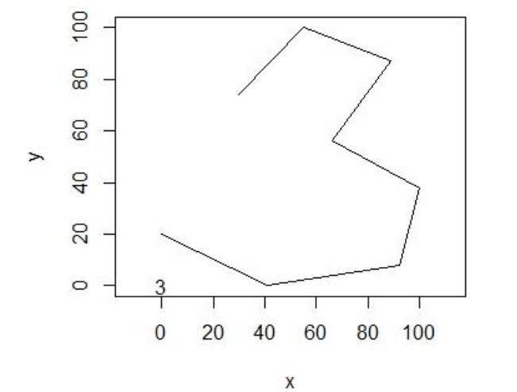

# handwritten-digit-classification
Handwritten digit classification with SVM, KNN and NN

This is not the famous (or infamous?) MNIST dataset. 

This dataset contains handwritten digits written with a digital pen. The digital drawing of the numbers has been simplified to eight two-dimensional points. (Connecting these, the numbers are quite recognisable for the eye.)
The coordinates of the eight points are in the first 16 columns in the order {(𝑥1,𝑦1),...,(𝑥8,𝑦8)}. 
The 17th column is the number that is supposed to be shown in the drawing. 

For example:

In this repo I have created classification algorithms in order to see which one gives more accurate predictions.